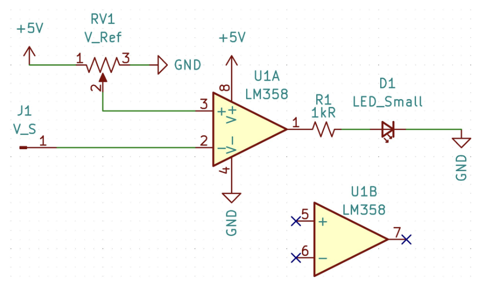
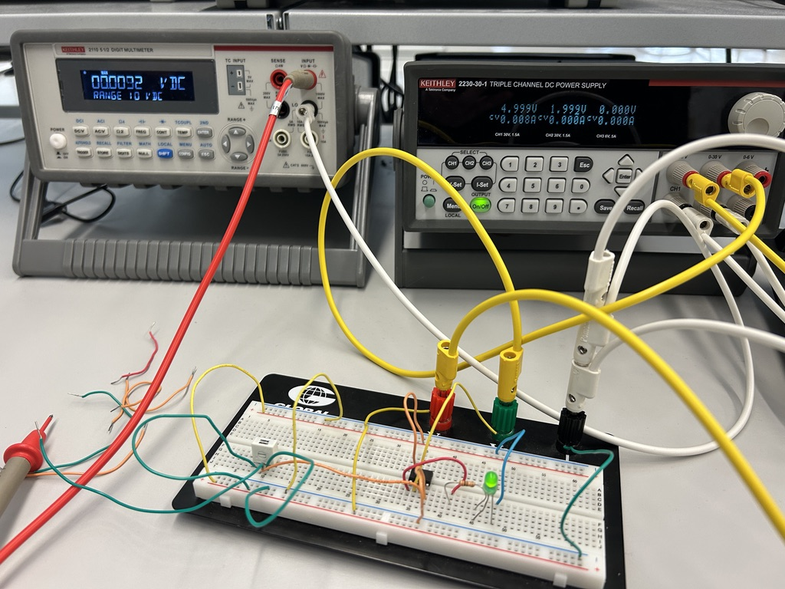

# Thermostat using Reference Voltage and Comparator

| | |
| --- | --- |
| **Course** | EEL2011C: Electrical and Computer Engineering Skills and Design |
| **Date** | Spring 2026 |

## Objective

This lab involves the use of an operational amplifier (op amp) and potentiometer to create a thermostat circuit.

In this lab, the temperature is set with a potentiometer, which acts as an adjustable reference voltage. Due to lack of an analog temperature sensor component, a power supply is used to simulate an analog temperature sensor. Similarly, an LED is used to simulate whether the heating unit would be on or off. Finally, an operational amplifier is used as a comparator to compare the reference voltage (desired temperature set by the potentiometer) to the sensor voltage (the "actual" temperaure simulated by the power supply).

## How it works

To understand why these components are used, we must first explore how and why thermostats work in the first place. A simple thermostat will know the desired temperature, check the current temperature, and figure out if the heater needs to be on or off.

To start, the circuit receives a constant voltage from the power supply but then the reference voltage must be set. A voltage divider circuit (two resistors connected in series) can be used to drop the input voltage down to a lower output voltage, as shown in the equation below.

$$V_{Ref} = V_{in} \cdot \left( \frac{R_2}{R_1 + R_2} \right)$$

However, these two resistors have a set resistance. Once the circuit is built, if we wanted to set the thermostat to a different temperature, we would have to replace the resistor with a resistor with a different value to change the reference voltage. Therefore, a potentiometer is used to create an adjustable reference voltage because a potentiometer is essentially an adjustable voltage divider.

Next, the thermostat needs to know whether to turn on or off the heater. This decision logic is handled by an op amp, which compares the reference voltage (the desired temperature set by the potentiometer) to the sensor voltage (the "actual" temperature simulated with a power supply). This is done by connecting the reference voltage ($V_{ref}$) to the op amp's noninverting input and the sensor temperature ($V_{s}$) to the inverting input (becomes -$V_{s}$). The voltages are added together, and when the value is positive, the output is HIGH, or 5V. This logic can be shown in the following expression:

$$
V_{out} =
\begin{cases}
5V (ON) & \text{if } V_{Ref} > V_{S} \\
0V (OFF) & \text{if } V_{Ref} < V_{S}
\end{cases}
$$

In the context of the thermostat, if the output of the op amp is 5V, the reference voltage is higher than the sensor voltage and the heater will turn on, and vice versa.

## Circuit Schematic

\
*Thermostat circuit schematic provided by Florida Poly ECE Department.*

## Working Circuit

\
*The DC power supply (background) provides 5V of power to the circuit from channel 1 and a "sensor voltage" from channel 2 to simulate the environment's temperature. The DMM is used to check what the reference voltage of the potentiometer is set to. When the sensor voltage on the power supply is increased to higher than the reference voltage, the LED (heater unit) turns off.*
